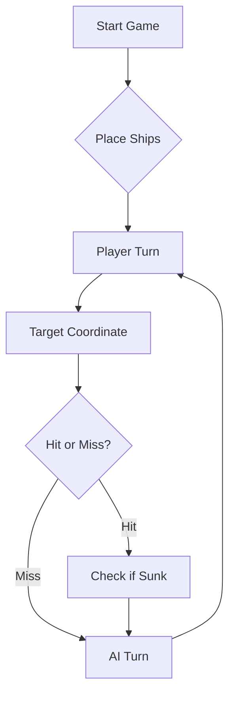

# Video Demo (https://youtu.be/n-aDsRmwi1k)

# ⚓ Battleship 2.0


> A modern take on the classic naval warfare game, designed for the XVII century setting with updated software engineering patterns.

---

## 📖 Table of Contents
- [Project Overview](#-project-overview)
- [Key Features](#-key-features)
- [Technical Stack](#-technical-stack)
- [Installation & Setup](#-installation--setup)
- [Code Architecture](#-code-architecture)
- [Roadmap](#-roadmap)
- [Contributing](#-contributing)

---

## 🎯 Project Overview
This project serves as a template and reference for students learning **Object-Oriented Programming (OOP)** and **Software Quality**. It simulates a battleship environment where players must strategically place ships and sink the enemy fleet.

### 🎮 The Rules
The game is played on a grid (typically 10x10). The coordinate system is defined as:

$$(x, y) \in \{0, \dots, 9\} \times \{0, \dots, 9\}$$

Hits are calculated based on the intersection of the shot vector and the ship's bounding box.

---

## ✨ Key Features
| Feature | Description | Status |
| :--- | :--- | :---: |
| **Grid System** | Flexible $N \times N$ board generation. | ✅ |
| **Ship Varieties** | Galleons, Frigates, and Brigantines (XVII Century theme). | ✅ |
| **AI Opponent** | Heuristic-based targeting system. | 🚧 |
| **Network Play** | Socket-based multiplayer. | ❌ |

---

## 🛠 Technical Stack
* **Language:** Java 17
* **Build Tool:** Maven / Gradle
* **Testing:** JUnit 5
* **Logging:** Log4j2

---

## 🚀 Installation & Setup

### Prerequisites
* JDK 17 or higher
* Git

### Step-by-Step
1. **Clone the repository:**
   ```bash
   git clone [https://github.com/britoeabreu/Battleship2.git](https://github.com/britoeabreu/Battleship2.git)
   ```
2. **Navigate to directory:**
   ```bash
   cd Battleship2
   ```
3. **Compile and Run:**
   ```bash
   javac Main.java && java Main
   ```

---

## 📚 Documentation

You can access the generated Javadoc here:

👉 [Battleship2 API Documentation](https://britoeabreu.github.io/Battleship2/)


### Core Logic
```java
public class Ship {
    private String name;
    private int size;
    private boolean isSunk;

    // TODO: Implement damage logic
    public void hit() {
        // Implementation here
    }
}
```

### Design Patterns Used:
- **Strategy Pattern:** For different AI difficulty levels.
- **Observer Pattern:** To update the UI when a ship is hit.
</details>

### Logic Flow


---

## 🗺 Roadmap
- [x] Basic grid implementation
- [x] Ship placement validation
- [ ] Add sound effects (SFX)
- [ ] Implement "Fog of War" mechanic
- [ ] **Multiplayer Integration** (High Priority)

---

## 🧪 Testing
We use high-coverage unit testing to ensure game stability. Run tests using:
```bash
mvn test
```

> [!TIP]
> Use the `-Dtest=ClassName` flag to run specific test suites during development.

---

## 🤝 Contributing
Contributions are what make the open-source community such an amazing place to learn, inspire, and create.

1. Fork the Project
2. Create your Feature Branch (`git checkout -b feature/AmazingFeature`)
3. Commit your Changes (`git commit -m 'Add some AmazingFeature'`)
4. Push to the Branch (`git push origin feature/AmazingFeature`)
5. Open a **Pull Request**

---

## 📄 License
Distributed under the MIT License. See `LICENSE` for more information.

---
**Maintained by:** [@britoeabreu](https://github.com/britoeabreu)  
*Created for the Software Engineering students at ISCTE-IUL.*

## Prompt Final 
Cria um Diário de Bordo com o registo de cada rajada disparada, numerando-as sequencialmente (Rajada 1, 2, 3...). Guarda as coordenadas exatas de cada tiro, o respetivo resultado (Água, Nau atingida, Barca afundada, etc.) e o modo em que jogaste nessa rajada (Caça ou Abate). A memória é a principal arma de um bom estratega.
Mantém em paralelo um Inventário da Frota inimiga com todas as embarcações do jogo. À medida que as afundas, risca-as e atualiza o total de células ainda por descobrir. Isto diz-te sempre quanto território inimigo resta no mapa — e quando só restar um navio de comprimento N com uma única zona compatível no tabuleiro, esse navio está lá. Dispara diretamente, sem hesitar.
Não dispares fora dos limites do mapa nem repitas tiros em coordenadas já testadas. A única exceção para este desperdício de pólvora é a última rajada do jogo, apenas para perfazer os 3 tiros obrigatórios quando a frota inimiga já estiver irremediavelmente no fundo do mar.
Existem dois modos de jogo e nunca os deves confundir. O Modo Caça é usado quando não há nenhum navio parcialmente atingido em abate. O Modo Abate é usado quando há pelo menos um tiro certeiro por confirmar — e tem sempre prioridade absoluta sobre o Modo Caça. Enquanto houver uma posição atingida por resolver, a rajada inteira deve ser usada para avançar no abate.
Em Modo Caça, usa um padrão de xadrez: dispara apenas nas células de uma cor do tabuleiro, alternando como as casas pretas de um xadrez. A justificação é matemática — o menor navio ocupa pelo menos 2 células consecutivas, pelo que obrigatoriamente ocupa uma célula de cada cor. Com este padrão cobres toda a frota com metade dos tiros, eliminando disparos redundantes. Dentro do padrão, prioriza as zonas com mais espaço livre e maior concentração de células desconhecidas.
Se atingires um navio numa rajada sem ainda saberes a sua orientação, dispara nas 4 direções cardeais (Norte, Sul, Este, Oeste) na jogada seguinte para a descobrir. Começa pelas direções com mais espaço livre à frente — quanto maior o corredor disponível, maior a probabilidade de o resto do navio estar nesse sentido. Assim que dois tiros certeiros se alinharem, a orientação fica confirmada e passas imediatamente ao passo seguinte.
Quando a orientação de um navio estiver confirmada por dois ou mais tiros alinhados, bloqueia de imediato as direções perpendiculares como água inferida — os navios retos nunca dobram, portanto o resto só pode estar no eixo já identificado. A partir desse momento, dispara exclusivamente nas extremidades da sequência de tiros certeiros, prolongando para um lado e para o outro, e conta sempre os acertos já registados para saberes quantas células ainda faltam para afundar o navio.
Como as Caravelas, Naus e Fragatas são linhas retas, um tiro certeiro nestes navios significa que as 4 posições diagonais desse tiro são garantidamente água. Marca-as imediatamente e nunca lá dispares — poupa uma quantidade brutal de pólvora ao longo da partida.
O Galeão tem forma em T e exige tratamento especial. As diagonais de um tiro certeiro no Galeão não são água garantida, pois o corpo em T permite que haja partes do navio em direções perpendiculares. Se descobrires acertos que não se alinham num eixo reto, suspeita imediatamente do Galeão. Só marca o halo adjacente depois de teres o T completo confirmado — haste e barra.
Quando o relatório de uma rajada confirmar que um navio foi afundado, analisa os dados do teu Diário de Bordo para identificar exatamente onde caíram todos os tiros certeiros desse navio. Confirmada a posição exata da carcaça, marca todas as quadrículas adjacentes — incluindo diagonais — como água intransitável. É impossível haver outra embarcação nesse perímetro. Nunca dispares para essas posições.
Se afundares um navio a meio de uma rajada, os tiros restantes não vão para o halo já inferido — esse espaço é água garantida e disparar para lá é desperdício puro. Usa os tiros restantes em Modo Caça para avançar no padrão de xadrez, ou direciona-os para outro navio parcialmente atingido que ainda esteja por resolver.
Cada rajada tem 3 tiros e nunca os desperdiças. Em Modo Abate, usa os 3 para avançar sequencialmente: se o primeiro tiro acertar, o segundo prolonga na mesma direção; se o primeiro falhar numa extremidade, o segundo e o terceiro redirecionam para a extremidade oposta. Em Modo Caça, distribui os 3 pelo padrão de xadrez nas zonas com maior densidade de células desconhecidas.
Se a tua frota for toda afundada, declara a derrota com honra, apresentando o estado final do Diário de Bordo. Em contrapartida, se for o inimigo a ter toda a frota no fundo do oceano, declara a vitória com o total de rajadas usadas e calcula a tua eficiência: células de navio afundadas a dividir pelos tiros não desperdiçados. Um verdadeiro estratega mede sempre o custo da vitória.
